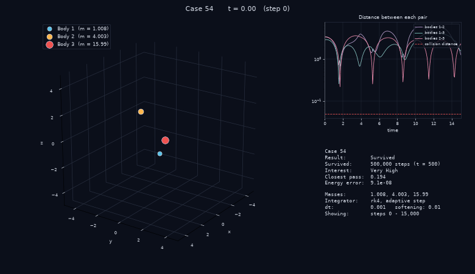
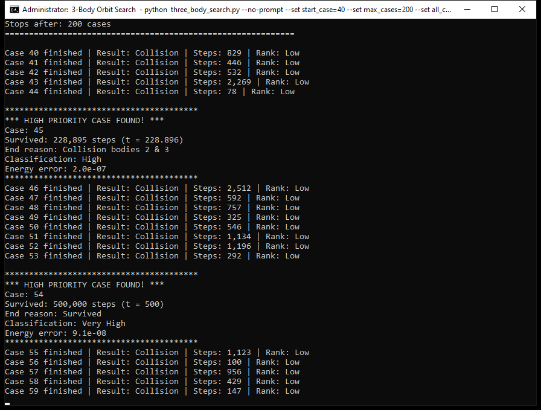
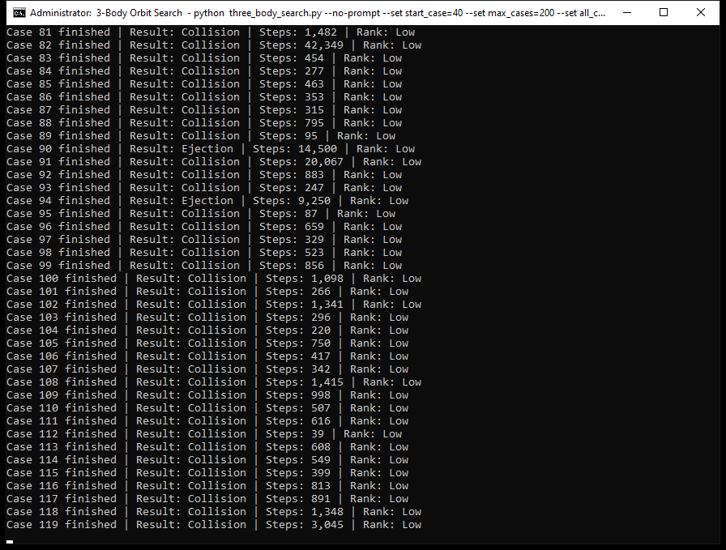
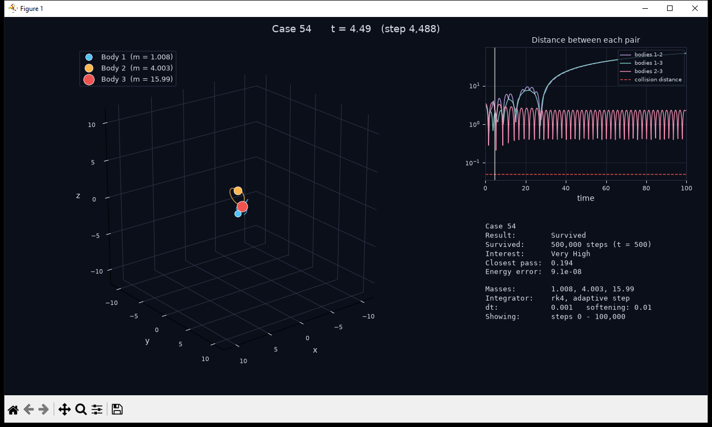
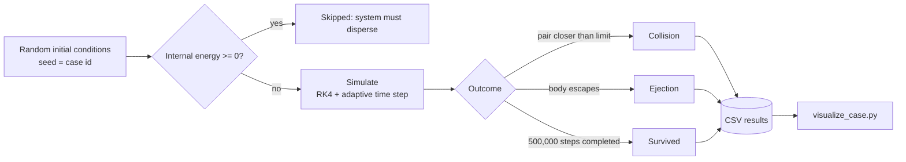

<div align="center">

# 3-Body Orbit Search

**A high-performance search for rare, long-lived three-body gravitational systems**


[Demo](#-demo) ·
[About](#1-about) ·
[Features](#2-features) ·
[Installation](#3-installation) ·
[Quick Start](#4-quick-start) ·
[Visualiser](#5-visualiser) ·
[Settings](#6-settings) ·
[How It Works](#7-how-it-works)

</div>

---

## 🎬 Demo

<div align="center">



<sub><b>A surviving system replayed in the visualiser:</b> three bodies sized by mass, with fading trails.</sub>

</div>

<br>

### 🖥️ The search in action

The search runs thousands of random systems back to back. Most end in a quick collision or ejection, and the rare long-lived ones are flagged automatically.

<table align="center">
  <tr>
    <td align="center" width="50%">
      
      <br><sub><b>Rare find:</b> case 54 survives all 500,000 steps and is ranked <i>Very High</i>.</sub>
    </td>
    <td align="center" width="50%">
      
      <br><sub><b>Typical progress:</b> most cases end in collision, a few in ejection.</sub>
    </td>
  </tr>
</table>

### 🔭 The visualiser

Replay any case with `python visualize_case.py 54`. It shows the 3D motion, the pair-distance graph and the run statistics together.

<table align="center">
  <tr>
    <td align="center" width="50%">
      
      <br><sub><b>t = 4.49:</b> the heavy body and the middle body form a tight pair.</sub>
    </td>
    <td align="center" width="50%">
      
      <br><sub><b>t = 12.21:</b> the light body is flung outward on a long loop.</sub>
    </td>
  </tr>
</table>

> 💡 The <b>top-right graph</b> is the quickest way to read a system: the pair distances must stay above the dashed red <i>collision distance</i> line for the system to survive.

---

## 1. About

The two-body problem has an exact solution: every orbit is an ellipse, parabola or hyperbola. Adding a **third body** removes any general closed-form solution; the motion becomes **chaotic**, so a change in the fifteenth decimal place of a starting position can eventually change the entire outcome.

This project numerically simulates thousands of randomly generated three-body systems, one after another. For each system it records how long it survives before two bodies **collide** or one is **ejected**. Systems that survive for a long time are classified as **High** or **Very High** interest, and any case can be replayed as a 3D animation.



---

## 2. Features

| Area | Description |
|---|---|
| **Compiled physics engine** | The simulation loop is compiled to machine code with Numba: **1,400x faster** per step |
| **Adaptive time step** | Small steps are taken only during close encounters: **~50,000x smaller energy error** at the same CPU cost |
| **Collision-detection fix** | The original checked every 50 steps and gave the wrong result for **half** of the first 30 test cases |
| **Physical ejection test** | A body counts as ejected only if it is distant, **exceeds escape energy**, and is receding |
| **Accuracy tracking** | The relative energy error is recorded for every case, with a warning for unreliable results |
| **Background operation** | Below-normal priority, a CPU-percentage limiter and a configurable pause: about **2% of one core** by default |
| **Multi-core mode** | Batched worker processes: **3.1x throughput** with 5 workers |
| **Crash-safe resume** | Resumes from the CSV itself, writes progress atomically, and repairs partially written lines |
| **Configurable** | Start-up menu, `settings.json`, `--set name=value` overrides, and presets |
| **Visualiser** | 3D/2D animation with trails, a pair-distance graph, and GIF/MP4/PNG export |
| **Backward compatible** | Case *N* starts from exactly the same initial conditions as in the original script |

---

## 3. Installation

**Requirement:** Python **3.9 or newer** ([download](https://www.python.org/downloads/)).

```bash
# Step 1 - clone the repository
git clone https://github.com/NehvX/3bodyproblem.git
cd 3bodyproblem

# Step 2 - (optional) create a virtual environment
python -m venv venv
venv\Scripts\activate          # Windows
source venv/bin/activate       # macOS / Linux

# Step 3 - install dependencies
pip install -r requirements.txt
```

| Package | Purpose |
|---|---|
| [`numpy`](https://numpy.org/) | Numerical arrays |
| [`numba`](https://numba.pydata.org/) | Compiles the physics engine to machine code (optional; the program runs without it, but much more slowly) |
| [`matplotlib`](https://matplotlib.org/) | Visualiser |

> **Note:** On the first run, Numba compiles the engine, which takes about 5 seconds. The compiled code is cached, so later runs start in under a second.

---

## 4. Quick Start

```bash
python three_body_search.py                 # start the search (Ctrl+C pauses; run again to resume)
python visualize_case.py --list             # list the best cases found
python visualize_case.py 54                 # replay case 54
python visualize_case.py --preset figure8   # replay a well-known stable orbit
python benchmark.py                         # measure performance on this machine
```

At start-up the program shows the active settings and counts down for 10 seconds. Press **C** to customise the settings, or **Enter** to start immediately.

**Sample output**

```text
Case 53 finished | Result: Collision | Steps: 1,204 | Rank: Low

****************************************
*** HIGH PRIORITY CASE FOUND! ***
Case: 54
Survived: 500,000 steps (t = 500)
End reason: Survived
Classification: Very High
Energy error: 9.1e-08
****************************************
[Status] 300 cases in 0.0 min (423.77/s) | Collision: 274 | Ejection: 24 | Survived: 2 | High: 9 | Very High: 2
```

---

## 5. Visualiser

```bash
python visualize_case.py 54                     # live window (SPACE = pause / resume)
python visualize_case.py 54 --2d --trail 0      # top-down view with the full path
python visualize_case.py 45 --full              # the entire run instead of only the ending
python visualize_case.py custom_1               # a custom-mode run
python visualize_case.py 54 --save case54.gif   # export an animation (.gif / .mp4)
python visualize_case.py 54 --save case54.png   # export a still image
```

**Display layout**

- **Left panel:** the three bodies, sized by mass, with fading trails. The 3D camera rotates slowly.
- **Top-right panel:** the separation of each pair over time. The dashed red line is the collision distance.
- **Bottom-right panel:** the outcome, survival time, closest approach, energy error and simulation settings.

The visualiser reads the physics parameters from the CSV row, so every case is replayed **exactly** as it was simulated.

| Option | Description |
|---|---|
| `--list` | List the highest-ranked cases |
| `--preset figure8` / `pythagorean` | Replay a well-known system |
| `--custom` | Replay the custom case defined in `settings.json` |
| `--start N --end M` / `--full` | Choose the range of steps to display |
| `--frames`, `--interval` | Smoothness and playback speed |
| `--zoom 3`, `--no-rotate`, `--no-com` | Camera options |
| `--save file.gif/.mp4/.png` | Export (MP4 requires [ffmpeg](https://ffmpeg.org/)) |

---

## 6. Settings

### 6.1 Ways to configure

| Method | How | Scope |
|---|---|---|
| Interactive menu | Press **C** at start-up, or run `python three_body_search.py --setup` | Saved if **S** is chosen |
| Settings file | Edit [`settings.json`](settings.json) | Permanent |
| Command line | `--set workers=4 --set throttle_delay=0` | Current run only |

### 6.2 Principal parameters

All 32 parameters are documented in [PARAMETER_GUIDE.txt](PARAMETER_GUIDE.txt).

| Parameter | Default | Description |
|---|---|---|
| `mode` | `random` | `random` search, or `custom` to run a single user-defined system |
| `masses` | `[1.007825, 4.002603, 15.994915]` | Atomic masses of H, He and O |
| `dt` | `0.001` | Time step (the largest step in adaptive mode) |
| `integrator` | `rk4` | `rk4` (accurate) or `leapfrog` (about 3.5x cheaper) |
| `timestep` | `adaptive` | `adaptive` or `fixed` (original behaviour) |
| `min_steps` / `long_test_steps` | `50000` / `500000` | High / Very High thresholds |
| `collision_dist` / `ejection_dist` | `0.05` / `10.0` | Termination conditions |
| `ejection_test` | `energy` | `energy` (physically correct) or `distance` (original) |
| `workers` | `1` | CPU cores to use (`"auto"` = all but one) |
| `throttle_delay` | `0.1` | Pause after each case, in seconds |
| `cpu_limit_percent` | `100` | Target CPU usage per worker |
| `low_priority` | `true` | Run at below-normal process priority |

### 6.3 Example configurations

```bash
# Maximum throughput
python three_body_search.py --set workers=auto --set throttle_delay=0 --set print_each_case=false

# Low-impact background operation
python three_body_search.py --set cpu_limit_percent=20

# Closest to the original script's behaviour
python three_body_search.py --set timestep=fixed --set ejection_test=distance --set skip_unbound=false

# Preset systems
python three_body_search.py --preset figure8
python three_body_search.py --preset pythagorean
```

---

## 7. How It Works

A complete explanation of every equation and every section of the code, written for class 11/12 level, is in [EXPLANATION.txt](EXPLANATION.txt). A summary follows.

### 7.1 Gravitational acceleration (with softening ε)

```math
\vec{a}_i = \sum_{j \neq i} \frac{G m_j (\vec{r}_j - \vec{r}_i)}{\left(r_{ij}^2 + \varepsilon^2\right)^{3/2}}
```

### 7.2 Fourth-order Runge–Kutta integration

```math
y_{n+1} = y_n + \frac{\Delta t}{6}\left(k_1 + 2k_2 + 2k_3 + k_4\right)
```

### 7.3 Total energy and relative error

```math
E = \sum_{i} \frac{1}{2} m_i v_i^2 - \sum_{i \lt j} \frac{G m_i m_j}{\sqrt{r_{ij}^2 + \varepsilon^2}}
```

```math
\text{error} = \frac{\lvert E - E_0 \rvert}{\lvert E_0 \rvert}
```

### 7.4 Adaptive time step

```math
\Delta t = \min\left(\Delta t_{\max}, \; \eta \cdot \min_{\text{pairs}}\left[\sqrt{\frac{r^3}{G(m_i + m_j)}}, \; \frac{r}{v_{\text{rel}}}\right]\right)
```

### 7.5 Escape criterion

Body *k* is tested against the combined mass *M* of the other two bodies:

```math
E_k = \frac{1}{2}\mu v_{\text{rel}}^2 - \frac{G m_k M}{r} \gt 0, \qquad \vec{r} \cdot \vec{v} \gt 0, \qquad \mu = \frac{m_k M}{m_k + M}
```

### 7.6 Classification

| Survival | Interest level |
|---|---|
| Fewer than `min_steps` | Low |
| At least `min_steps`, then collision or ejection | High |
| All `long_test_steps` completed | Very High |

---

## 8. Output Files

| File | Contents |
|---|---|
| `3body_all_cases.csv` | Every case |
| `3body_high_interest.csv` | High and Very High cases only |
| `3body_custom_cases.csv` | Custom-mode runs (`custom_1`, `custom_2`, ...) |
| `3body_progress.json` | Last completed case (a backup; the CSV is the source of truth) |

**CSV columns:** `case_id`, masses, initial positions and velocities (full precision), `survival_steps`, `end_reason`, `interest_level`, `survival_time`, `event_detail`, `min_distance`, `energy_error`, `initial_energy`, and the physics settings used.

---

## 9. Project Structure

```text
3bodyproblem/
├── media/                 # Screenshots and animation used in this README
├── three_body_search.py   # Search program
├── visualize_case.py      # Animation and replay of any case
├── benchmark.py           # Original vs optimised performance test
├── settings.json          # Configuration (defaults = original values)
├── requirements.txt       # numpy, numba, matplotlib
├── PARAMETER_GUIDE.txt    # Reference for every parameter
├── EXPLANATION.txt        # Physics and code explanation (class 11/12 level)
└── FEATURES.txt           # Complete list of improvements
```

---

## 10. References

- [Three-body problem](https://en.wikipedia.org/wiki/Three-body_problem) (Wikipedia)
- [Runge–Kutta methods](https://en.wikipedia.org/wiki/Runge%E2%80%93Kutta_methods)
- [Leapfrog integration](https://en.wikipedia.org/wiki/Leapfrog_integration)
- [Chenciner & Montgomery (2000), *A remarkable periodic solution of the three-body problem*](https://arxiv.org/abs/math/0011268)
- [Numba documentation](https://numba.readthedocs.io/)

---

<div align="center">

Repository: [github.com/NehvX/3bodyproblem](https://github.com/NehvX/3bodyproblem)

</div>
